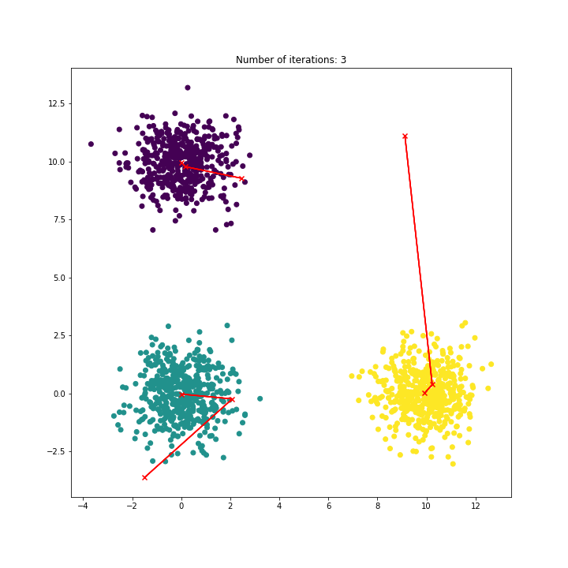
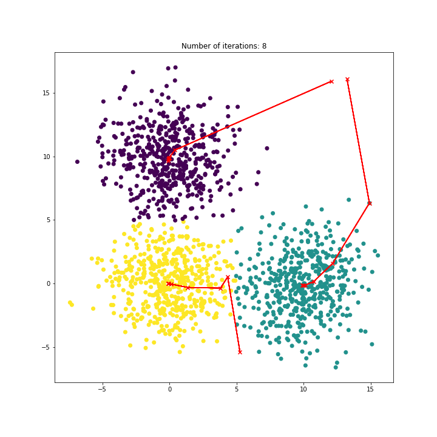
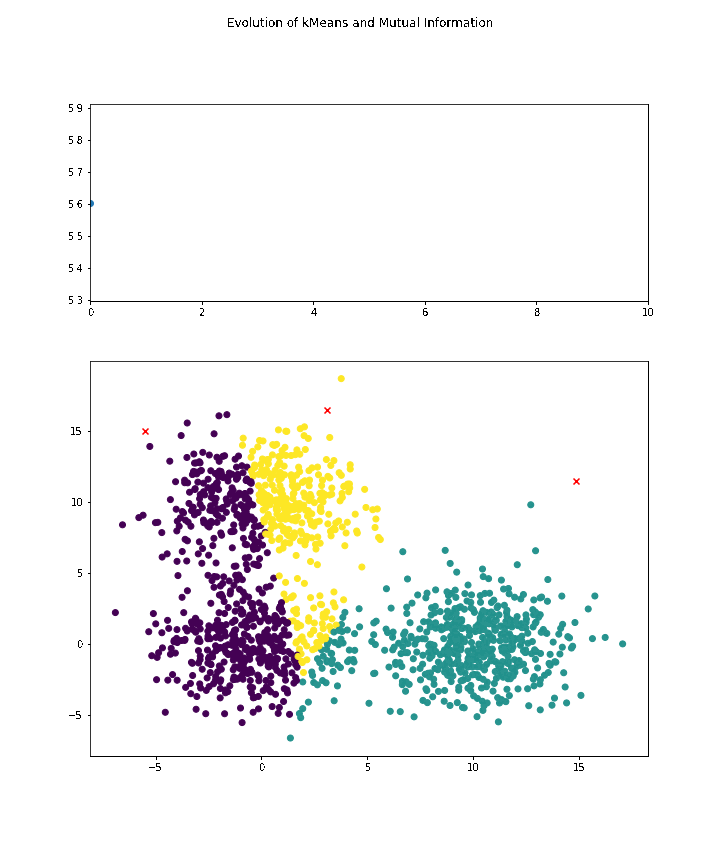

# Clustering and Information Theory

One of the most used clustering algorithms is the kMeans clustering: we find k clusters of data points based on an iterative process that assigns points to the nearest centroid and then updates the position of the centroid. The algorithm converges when the clusters don't change. In this project we developed a kMeans algorithm from scratch and explore the behavior of the mutual entropy between the ground truth and the prodecited labels. We use a 3-cluster bivarite gamma distribution as an example.

Any clustering algorithm should minimize the intra-cluster distance and maximize the inter-cluster distance. We use mutual information as a metric of cluster "goodness". Note that in general the clustering problem is unsupervized, so we don't have the ground truth available but in this exercise we know it by design.

It is interesting to explore the path or trajectory of the centroids [TODO]

Exploring the mutual information we notice that it starts at a low value and each iteration increases until it reaches a maximum - the entropy of the ground truth-  when the two distributions are the same - MI(X;X) = H(X) 

