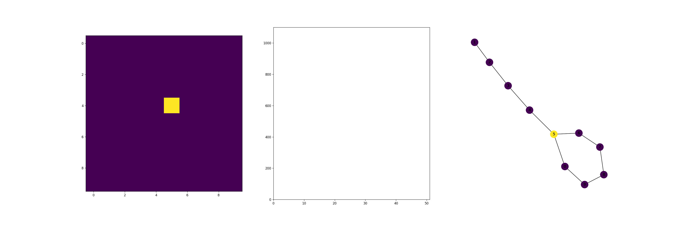

# Reinforcement Learning

We implemented a Q-learning algorithm to find the shortest path between a destination node and any other point in an arbitrary network. 
The Q-learming algorithm has the following elements
- a set of states 
- a set of actions
- one agent 
- a reward matrix that favors the destination node and its neighbors

The algorithm defines a matrix Q that it is updated with examples (episodes) until convergence. Once the model is trained, we can find the shortest path by selecting an starting node and selecting the action (move to state) that maximizes Q for that state. We repeat until reaching the destination node. 

In the animation below, we can see how the Q-matrix evolve as the algorithm learns. The score measures changes in Q and each node has a different Q.

